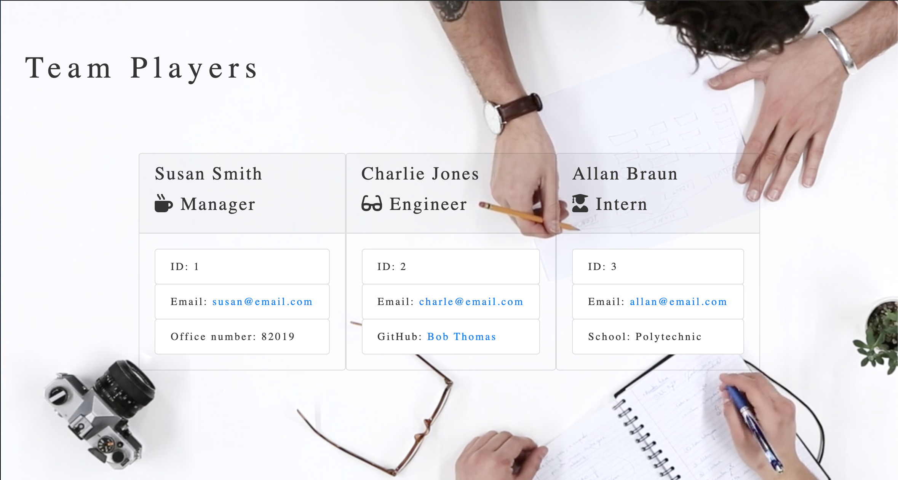

##  <h3 align = "center"> Team Players </h3>

 ## Project Description 
      This is a CLI program that assists a manager in entering their teams information.  Right now it is structured for an engineering company but in practice could be used for any type of business.  It includes their Name, Role, Github, and School (if they are an intern).  
                        
 ## Table of Contents
* [Project Description](#project-description)
* [Installation Instructions](#installation-instructions)
* [Usage Information](#usage-information)
* [Contribution Guidelines](#contribution-guidelines)
* [Test Instructions](#test-instructions)
* [Questions](#questions)

    
 
## Licenses    
    This applicaiton is covered with:
    

    
    This is a CLI program that assists a manager in entering their teams information.  Right now it is structured for an engineering company but in practice could be used for any type of business.  It includes their Name, Role, Github, and School (if they are an intern).  
                        
 ## Installation Instructions

    Must install npm and inquirer and is run through the computer terminal. 
                        
 ## Usage Information
 
    Use for company profile building.
                        
 ## Contribution Guidelines
 
    
                        
 ## Test Instructions
 
    To test, download npm test and run through the test folder.
                        
 ## Questions
 
                        Feel free to contact me via Gifthub or by my e-mail!
Github Username:  rbraun04

 <a href = "https://github.com/rbraun04">GitHub</a> - Click to go to my profile!

 Email:  ryan@thelyricla.com

 [![LinkedIn][linkedin-shield]][linkedin-url]

[linkedin-shield]: https://img.shields.io/badge/-LinkedIn-black.svg?style=flat-square&logo=linkedin&colorB=555
[linkedin-url]: https://linkedin.com/in/ryangbraun
[Boost-shield]: https://img.shields.io/badge/License-Boost%201.0-lightblue.svg
[Boost-url]: https://www.boost.org/LICENSE_1_0.txt
                       